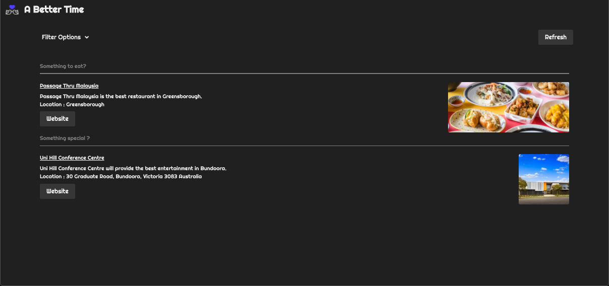

# date-planner-app
```
An app to plan your date night
```



Plan your next date --> [Date Planner](https://darren-behan.github.io/a-better-time/)

## User Story

```
As busy modern day human beings...
We want help to minimise stress when planning what to do in our free time... 
So that we can make an informed and stress free decision about where to eat or where to go and do activities near us
When we open the app
Then we will be presented with a random choice 
When we press “submit”
Then we’re presented with the best places to eat/movies to watch/concerts to see
When we click on an event
Then a new section pops up showing informations regarding the concerts, including the availability, artist’s past album and a button to buy the ticket concert
When we click on ‘buy ticket’ button
Then we am redirected to a location where I can buy the concert’s ticket
```

## Application Requirements

* Must use at least two server-side APIs

* Must use a CSS framework _other than_ Bootstrap

* Must be interactive (i.e: accept and respond to user input)

* Use at least one new third-party API

* Must have a polished UI

* Must meet good quality coding standards

* Does not use alerts, confirms or prompts (look into _modals_)

* Must be deployed to GitHub Pages

```
This app is powered by Bulma, Javascript, jQuery & server-side API's.
```
